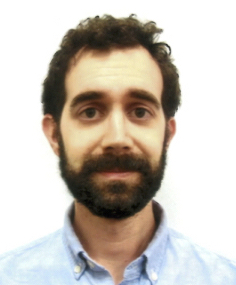

---
# Feel free to add content and custom Front Matter to this file.
# To modify the layout, see https://jekyllrb.com/docs/themes/#overriding-theme-defaults

layout: page
title: About
---

{: .center-image}

I'm a graduate student (since 2014) in the [ECE department][ece-page] at Johns
Hopkins, where I'm advised by [Sanjeev Khudanpur][sanjeev-page] and
[Greg Hager][greg-page]. I am affiliated with the Center for Language and
Speech Processing ([CLSP][clsp]) and the the Computational Interaction and Robotics Lab
([CIRL][cirl]).

My research interests include statistical signal processing,
computer vision, graphical models, and information theory.

# News
**Nov 5, 2018:** Our paper, *Toward computer vision systems that understand
real-world assembly processes*, has been accepted at WACV 2019.

[ece-page]: https://engineering.jhu.edu/ece/
[sanjeev-page]: https://www.clsp.jhu.edu/faculty-pages/sanjeev/
[greg-page]: http://www.cs.jhu.edu/~hager/
[cirl]: https://cirl.lcsr.jhu.edu/
[clsp]: https://www.clsp.jhu.edu/
